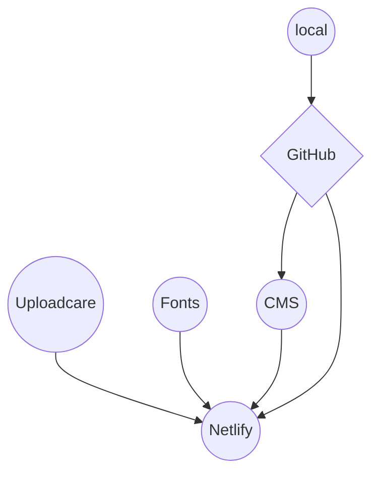

How the website works?

## Main 3 technologies

The sportclimbs.uk website is based upon three main technologies: [Hugo][2] static site generator, Git version control and [Netlify][1] serverless web hosting.

### Hugo

[Hugo][2] is a type of program called a static site generator. These programs take template files and content files and blend them together to create a whole web site.

[Hugo][2] is currently one of, if not the, fastest static site generator. To build the sportclimbs.uk website, which is about 400 pages, currently takes about a minute.

### Git and GitHub

Git is a very popular *version control program*. When developing a piece of software, or it could be a website, it will save the whole project when you tell it to. This mean you are able go back in time to see older versions of the project.

Git is used with [GitHub][3] which is a website for storing and sharing Git based software or website projects. The files making up the sportclimbs.uk website (in their unbuilt form) are stored on GitHub. When we make changes to the website files it's fast and easy to update these on GitHub.

### Netlify

[Netlify][1] is one of several online services especially designed for hosting *static websites*. A term used is *serverless web hosting*. Although websites have to have a server to share them with the world wide web the term *serverless* refers to the invisibilty of the server to us. It's out of the way and needs no maintenance or work by us.

[Netlify][1] is connected to the unbuilt website files on GitHub. If these are changed Netlify gets a signal and rebuilds the website using it's own version of Hugo.

Netlify also has other built in services like the contact form for the site. Another service is authentication which will be used for logging into the CMS safely.

We are currently using the free tier on Netlify which allows 100gb of bandwidth per month. Looking at the records of the old website in the busiest summer months we only used about 6gbs of bandwidth. So we have plenty of extra at the moment.

The Netlify free tier also allows for 300 minutes of build time per month. As the time to rebuild the site currently takes about 1 minute this means we can update the site about 300 times per month or 10 times per day.

There are several similar services to [Netlify][1]. Cloudflare is a good one and has unlimited bandwidth. But the build time limit is less and it harder to set up the CMS. Vercel is another similar service but has less bandwidth (the last time I looked) but is possibly better for programming features for more complicated apps.

## Other technologies

### Netlify CMS

This is free open source software built by Netlify. Although it works with other services (apart from Netlify's webhosting) it's easier to set up with Netlify.

It works by providing a user friendly interface to edit the website files on [GitHub][3]. These changes then trigger a rebuild of the site on Netlify web hosting.

[1]: https://netlify.com/
[2]: https://gohugo.io/
[3]: https://github.com/

### Uploadcare

This online service serves images that are automatically sized to fit a user-agents screen size. 

The [free plan](https://app.uploadcare.com/accounts/settings/billing/) includes:

- 3000 uploads per month
- 3gb of storage in total
- max file size of 500mb
- 30gb of bandwidth per month
- unlimited image transformations

#### Useful links

- [Instructions on how to use](https://uploadcare.com/docs/delivery/adaptive-delivery/#adaptive-delivery)

